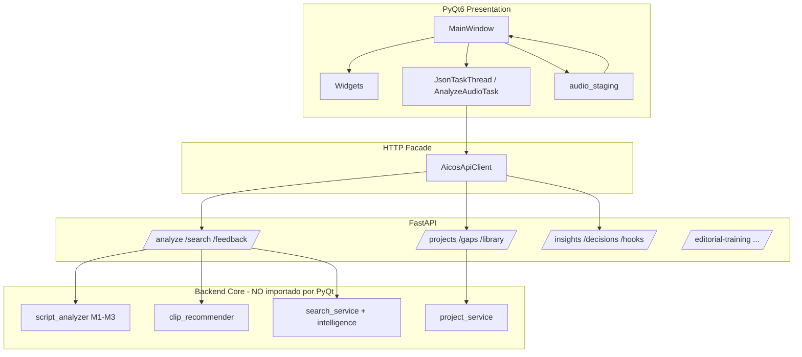
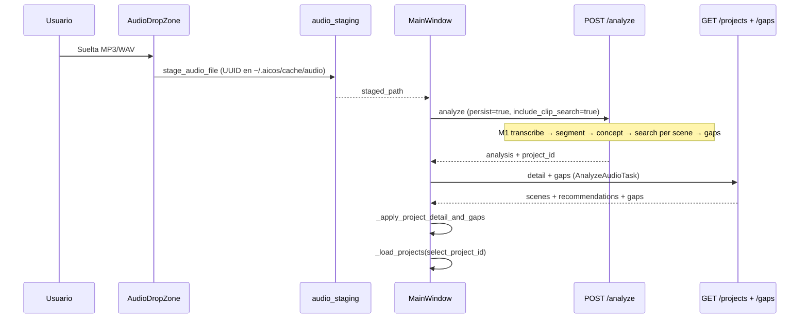

# Phase 7.0 — Legacy Python Dashboard → React Cinematic Studio

## Documento maestro de contexto para migración

| Campo | Valor |
|-------|--------|
| **Versión** | 1.0 |
| **Fecha** | 2026-05-19 |
| **Alcance** | Análisis y planificación — **sin implementación** |
| **Legacy UI** | PyQt6 (`aicos/frontend/`) |
| **Target UI** | React + Vite (`frontend/`) |
| **Backend** | FastAPI (`aicos/api/`) — ya desacoplado vía HTTP |

---

## 1. Resumen ejecutivo

### 1.1 Qué es el “frontend Python” real

No es Streamlit ni una web embebida: es un **dashboard de escritorio PyQt6** lanzado con:

```bash
aicos-dashboard
# equivalente: python -m aicos.frontend.dashboard
```

Requisito: `pip install 'aicos[ui]'` (PyQt6). La UI **no importa** dominio ni servicios directamente; habla **solo** con FastAPI local vía `httpx` (`AicosApiClient`).

### 1.2 Por qué esta migración es crítica

El React actual (`frontend/src/features/editorial-training/`) cubre el **Studio de entrenamiento editorial** (Fase 6.x): sesiones de dataset, timeline visual de revisión, merge de escenas, taxonomía semántica, registro editorial, commit a dataset.

El **núcleo de producción diaria** — analizar audio, segmentar guion, buscar clips en Chroma, aceptar/rechazar candidatos, explorar biblioteca, ver gaps M3 — **sigue en PyQt6**. Sin migrar esto, React no reemplaza el producto principal.

### 1.3 Hallazgo clave: dos productos frontend, un backend

| Dimensión | Legacy PyQt6 | React Editorial Training |
|-----------|--------------|---------------------------|
| **Usuario objetivo** | Productor / editor que arma creativos | Curador ML / entrenamiento editorial |
| **Entidad central** | `Project` + `Scene` (M1–M3) | `EditorialTrainingSession` + `CreativeTimeline` |
| **Tablas SQLite** | `projects`, `scenes`, `recommendations`, `gaps` | `editorial_training_sessions`, `creative_timelines`, `timeline_scenes`, reviews, semantic intents |
| **Análisis audio** | `POST /analyze` → `script_analyzer` | `POST /editorial-training/.../analyze` → capa application |
| **Selección de clip** | `POST /feedback` + `selected_clip_id` en escena | Timeline submit + human corrections + review |
| **Búsqueda semántica** | `POST /search` en UI principal | No expuesto (solo indirecto vía análisis) |
| **Proxy Vite** | **No** — rutas legacy sin proxy | Solo prefijos `/editorial-*`, `/timeline-visualization` |

### 1.4 CapCut y exportación

**No están implementados en el código actual del dashboard PyQt6.** Aparecen en PRD/TDD como Fase 4 futura:

- Exportación de lista de clips + timestamps para guiar edición manual en CapCut.
- CapCut Export Watcher (FO-1).
- Generador de proyecto `.capcut` (FO-2, alta complejidad).

Lo que **sí existe** hoy:

- Export de transcript JSON: `~/.aicos/exports/{project_id}_transcript.json` (`project_service._write_transcript`).
- Export de dataset editorial JSONL/Parquet vía `/editorial-dataset` (React training flow).

La migración React debe **planificar** export CapCut como módulo nuevo, no asumir que PyQt ya lo hace.

---

## 2. Arquitectura del frontend legacy (PyQt6)

### 2.1 Diagrama de capas



### 2.2 Estructura de archivos

```
aicos/frontend/
├── dashboard.py              # Entry: QApplication + MainWindow
├── main_window.py            # Orquestador único (~686 líneas)
├── client.py                 # AicosApiClient — contrato HTTP legacy
├── workers.py                # JsonTaskThread, AnalyzeAudioTask
├── utils/
│   └── audio_staging.py      # Copia audio a ~/.aicos/cache/audio
└── widgets/
    ├── audio_drop_zone.py    # Drag & drop MP3/WAV → analyze
    ├── library_sidebar.py    # Stats + búsqueda manual
    ├── library_clips_panel.py# Paginación GET /library/clips
    ├── transcript_panel.py   # Texto escena / inspección clip
    ├── recommendations_strip.py  # Thumbnails + Aceptar/Rechazar
    ├── gaps_panel.py         # Gap M3 por escena
    ├── insights_panel.py     # Fase 3 agregados
    └── decision_panel.py     # Fase 4 decisiones sistema
```

**Principio de diseño:** widgets = presentación pura; `MainWindow` = estado de sesión + coordinación de hilos.

### 2.3 Concurrencia y UX bloqueante

- Un solo hilo activo: `self._active_thread: JsonTaskThread | None`.
- Si hay petición en curso → `QMessageBox` “Espera a que termine la petición anterior.”
- Operaciones largas: `POST /analyze` (minutos), carga insights/decisions en tabs lazy.
- **Implicación migración:** React necesita cola de requests, estados `idle | loading | error`, y no bloquear toda la app por un analyze.

### 2.4 Configuración runtime

| Variable / config | Uso |
|-------------------|-----|
| `AICOS_API_BASE` | Default `http://127.0.0.1:8000` |
| Campo UI “API:” + “Usar URL” | `set_base_url` + reinicio biblioteca/proyectos |
| `config.yaml` → `paths.*` | Backend resuelve library, DB, Chroma; UI solo muestra paths de clips/thumbs |
| `config.yaml` → `ui.thumbnail_size` | Backend genera thumbs; PyQt escala a 168×98 en cards |

---

## 3. Estado en memoria (MainWindow)

No hay store global tipo Redux/Zustand. Todo vive en atributos de `MainWindow`:

| Estado | Tipo | Propósito |
|--------|------|-----------|
| `_client` | `AicosApiClient` | Base URL API |
| `_detail` | `dict \| None` | Respuesta `GET /projects/{id}` |
| `_gaps_by_scene_id` | `dict[str, dict]` | Índice rápido gap por `scene_id` |
| `_current_project_id` | `str \| None` | Proyecto seleccionado |
| `_search_preview` | `list[dict] \| None` | Resultados `/search` no persistidos en proyecto |
| `_active_thread` | `JsonTaskThread \| None` | Mutex de red |
| `_clips_page_size` | `int` (50) | Paginación biblioteca |
| `_insights_tab_loaded` | `bool` | Lazy load tab Insights |
| `_decisions_tab_loaded` | `bool` | Lazy load tab Decisiones |

**Señales Qt entre widgets:**

- `AudioDropZone.audio_dropped` → `handle_audio_file`
- `LibrarySidebar.manual_search_requested` → `_on_manual_library_search`
- `LibraryClipsPanel.clip_activated` / `load_more_requested`
- `RecommendationsStrip.feedback_submitted` → `_on_feedback`
- `InsightsPanel.recompute_requested` / `DecisionPanel.reevaluate_requested`

**Riesgo de migración:** la lógica de “preview search vs persisted recommendations” (`_search_preview`) debe modelarse explícitamente en React (draft vs server state).

---

## 4. Layout de pantalla y flujos de usuario

### 4.1 Layout físico (PRD Fase 2–4)

```
┌─────────────────────────────────────────────────────────────────────────────┐
│ API URL | [Usar URL] | [Analizar audio POST /analyze…]                      │
├─────────────────────────────────────────────────────────────────────────────┤
│                    AudioDropZone (drag MP3/WAV)                              │
├──────────────┬──────────────────────────────────────────────────────────────┤
│ LEFT TABS    │ CENTER                                                        │
│ ┌──────────┐ │ ┌─────────────┬──────────────────────┬─────────────┐         │
│ │Biblioteca│ │ │ Transcript  │ RecommendationsStrip │ GapsPanel   │         │
│ │Insights  │ │ └─────────────┴──────────────────────┴─────────────┘         │
│ │Decisiones│ │ [Re-buscar clips para escena (/search)]                      │
│ └──────────┘ │ ┌──────────────┬──────────────┐                              │
│              │ │ Proyectos    │ Escenas      │                              │
│              │ └──────────────┴──────────────┘                              │
└──────────────┴──────────────────────────────────────────────────────────────┘
```

### 4.2 Flujo A — Onboarding de creativo (crítico)



**Detalles:**

- Drop usa `enable_intelligence: true` implícito en body (no expuesto en UI del drop).
- Diálogo alternativo “Analizar audio…” usa **ruta directa** sin staging (puede fallar si API no ve el path).
- Tras éxito: refresco lazy de Insights/Decisiones si esas tabs ya se abrieron.

### 4.3 Flujo B — Selección editorial por escena (crítico)

1. Usuario selecciona **Proyecto** → `GET /projects/{id}` + `GET /gaps/{id}`.
2. Selecciona **Escena** → `TranscriptPanel` + `GapsPanel` + `RecommendationsStrip` con `scenes[].recommendations` persistidas.
3. Opcional: **Re-buscar clips** → `POST /search` con `concept`, `narrative_function`, `gender_hint`, `is_hook` → `_search_preview` (UI muestra “búsqueda nueva no persistida”).
4. Usuario **Aceptar/Rechazar** en card → `POST /feedback` → recarga proyecto manteniendo escena seleccionada.

**Efecto en backend (`project_service.update_recommendation_feedback`):**

- Actualiza fila `recommendations.accepted`.
- Si `accepted`: `scenes.selected_clip_id = clip_id`.
- Si rechazo del clip seleccionado: puede limpiar `selected_clip_id`.
- Opcional: `prompt_intelligence_service.record_feedback_event` + human feedback reinforcement (flag `record_editorial_human_feedback` default **false** en PyQt).

### 4.4 Flujo C — Exploración de biblioteca (sin proyecto)

1. `GET /library/stats` + `GET /library/clips?limit=50&offset=0`.
2. Click clip → `TranscriptPanel.set_library_clip` + `POST /search` por `semantic_excerpt` (preview, **sin feedback**).
3. Búsqueda manual en sidebar → lista textual de scores (no thumbnails en sidebar).

### 4.5 Flujos D/E — Inteligencia operativa (secundarios para MVP React)

- **Insights tab:** `GET /insights/summary?refresh`, `/insights/gaps`, `/insights/trends` — JSON en `QPlainTextEdit`.
- **Decisiones tab:** `GET /decisions/summary`, `/list`, `/impact` — árbol filtrable.
- **Cliente expone pero MainWindow no usa en UI:** `/hooks/search`, `/benchmark/phase3`, `/taxonomy/reclassify/batch`.

---

## 5. Contrato HTTP — `AicosApiClient` (superficie legacy)

Archivo: `aicos/frontend/client.py`

| Método cliente | HTTP | Usado en UI | Notas |
|----------------|------|-------------|-------|
| `list_projects` | `GET /projects` | Sí | Lista inferior |
| `get_project` | `GET /projects/{id}` | Sí | Detalle + escenas + recommendations |
| `get_gaps` | `GET /gaps/{id}` | Sí | Panel gaps |
| `get_library_stats` | `GET /library/stats` | Sí | Sidebar |
| `get_clips` | `GET /library/clips` | Sí | Paginado |
| `post_search` | `POST /search` | Sí | Escena, biblioteca, similares |
| `post_feedback` | `POST /feedback` | Sí | Aceptar/rechazar |
| `post_analyze` / `analyze_audio` | `POST /analyze` | Sí | Pipeline completo |
| `get_insights_*` | `GET /insights/*` | Sí | Tab Insights |
| `get_decisions_*` | `GET /decisions/*` | Sí | Tab Decisiones |
| `get_hooks_search` | `GET /hooks/search` | **No** | API lista para hooks |
| `get_benchmark_phase3` | `GET /benchmark/phase3` | **No** | Evaluación |
| `post_taxonomy_reclassify_batch` | `POST /taxonomy/reclassify/batch` | **No** | Mantenimiento |

**Timeout:** 120s (crítico para analyze).

### 5.1 Payloads relevantes (schemas)

Fuente: `aicos/models/schemas.py`

**`POST /analyze` — `AnalyzeRequestBody`**

```json
{
  "audio_path": "/abs/path/audio.mp3",
  "project_name": "Proyecto",
  "product_name": null,
  "product_category": "salud/bienestar",
  "target_audience": "adultos 35-55",
  "gender_hint_default": null,
  "include_clip_search": true,
  "persist": true,
  "enable_intelligence": true
}
```

**`POST /search` — `SearchRequest`**

- `query`, `narrative_function`, `gender_hint`, `is_hook`
- `used_clip_ids` (anti-repetición en analyze)
- `n_results`, `candidate_pool_size`
- `record_usage`, `apply_intelligence` (default true en API; PyQt no los envía → defaults)
- Campos avanzados no usados por PyQt: `global_query_enrichment`, `reference_visual_fingerprint`, `reference_visual_cluster_id`

**`POST /feedback` — `FeedbackRequest`**

```json
{
  "scene_id": "uuid",
  "clip_id": "uuid",
  "accepted": true,
  "rank": 1,
  "record_editorial_human_feedback": false
}
```

**`GET /projects/{id}` — `ProjectDetailResponse`**

- `project`: id, name, status, audio_file_path, created_at
- `scenes[]`: scene_id, scene_index, text, concept, narrative_function, is_hook, gender_hint, **recommendations[]** con thumbnail_path, scores, accepted

### 5.2 APIs FastAPI NO consumidas por PyQt (ya usadas por React)

Prefijos registrados en `aicos/api/main.py` que React sí proxifica:

| Prefijo | Propósito |
|---------|-----------|
| `/editorial-training` | Sesiones, upload, analyze, workspace, commit |
| `/editorial-review` | Review escenas, bulk, **merge** |
| `/editorial-timeline` | Precisión temporal |
| `/editorial-registry` | Registro dataset / duplicados |
| `/editorial-category` | Override categoría PRODUCT |
| `/editorial-semantic-intent` | Taxonomía clip vs narrativa audio |
| `/timeline-visualization` | Tracks visuales, previews |
| `/human-feedback` | Refuerzo 6.6 |
| `/editorial-dataset` | Build/export timelines |

También existen en API pero sin UI React ni PyQt completa:

- `/cinematic/*` — inteligencia cinematográfica
- `/organize` — M4 incoming clips
- `/editorial` — metadata editorial por clip
- `/multimodal` — pipelines batch

---

## 6. Backend: pipelines que alimentan el dashboard legacy

### 6.1 Pipeline `POST /analyze` (M1 + M2 + M3)

Orquestador: `aicos/modules/script_analyzer.py` → expuesto por `aicos/api/routers/analyze.py`.

| Etapa | Componente | Salida |
|-------|------------|--------|
| Transcripción | `transcriber` (faster-whisper) | `Transcript` |
| Contexto global | `global_context_factory` + enrichment | `GlobalContextSummary`, vector opcional |
| Segmentación | `segmenter` | `list[Scene]` con tiempos, hook detection |
| Conceptos | `concept_extractor` (LLM o degradado) | `concept` por escena |
| Búsqueda | `audio_intelligence_service` si `enable_intelligence` else `clip_recommender` | `Recommendation[]` por escena |
| Gaps | `gap_handler.enrich_gap` si `is_gap` | keywords TikTok, prompts IA, taxonomía sugerida |
| Persistencia | `project_service.persist_full_analysis` si `persist=true` | SQLite + transcript JSON |

**Anti-repetición:** durante analyze, `used_clip_ids` acumula el top-1 de cada escena para penalizar repeats en siguientes (`repeat_clip_penalty` en config).

**Persistencia escena:**

- `selected_clip_id` = primer recommendation si hay resultados (auto-selección inicial, no decisión humana).
- `recommendations` tabla con rank, scores, `accepted=null`.

### 6.2 Pipeline `POST /search`

Router: `aicos/api/routers/search.py`

- Con `apply_intelligence` + sesión SQL: `search_service.run_search` (memoria de uso, boosts inteligencia).
- Sin sesión / flags off: `clip_recommender.recommend` (vector Chroma + boosts taxonomía).

Ranking base (`clip_recommender.build_ranked_recommendations`):

- Similitud embedding + boosts: `narrative_function`, `gender`, `hook`, penalización `used_clip_ids`.
- `final_score` clamped 0–1.
- Thumbnail desde metadata Chroma/SQLite.

### 6.3 Feedback y aprendizaje

- `POST /feedback` → SQLite + `prompt_intelligence_service`.
- Flag opcional → `human_feedback_reinforcement` (Fase 6.6) — **PyQt no lo activa**.
- React training usa rutas distintas para correcciones y commit dataset.

### 6.4 Modelo de datos legacy (SQLite)

Tablas principales (`aicos/database/db.py`):

| Tabla | Rol en UI legacy |
|-------|------------------|
| `clips` | Biblioteca, paths absolutos, thumbs |
| `projects` | Lista proyectos |
| `scenes` | Escenas con tiempos, concept, NF, selected_clip_id |
| `recommendations` | Candidatos por escena + accepted |
| `gaps` | Panel M3 |
| `global_contexts` | No mostrado directamente en PyQt (usado en search) |
| Eventos intelligence | Tras search/feedback (invisible en UI) |

**Separación editorial (Fase 6+):** `creative_timelines`, `timeline_scenes`, `editorial_training_sessions`, etc. — **otro grafo de datos**. Un creativo puede tener `project_id` en sesión training pero el dashboard legacy no navega timelines editoriales.

---

## 7. Frontend React actual (parcial)

### 7.1 Stack y entry

- **Vite + React 18 + TypeScript**
- Entry: `frontend/src/App.tsx` → solo `EditorialTrainingWorkspacePage`
- Estado: Zustand (`trainingWorkspaceStore`, `timelineDraftStore`)
- Estilos: CSS modular `editorial-training-workspace.css` (identidad “studio” oscura)

### 7.2 Wizard de 7 pasos

`EditorialTrainingWorkspacePage.tsx`:

1. Sesión — crear training session, creative_id
2. Activos — upload video + audio (`useCreativeUpload`)
3. Análisis IA — `useTimelineAnalysis` → `/editorial-training/.../analyze`
4. Timeline — `VisualTimelineEditor`, merge, semantic intent, audio context banners
5. Review Summary
6. Resumen estilo
7. Commit — dataset + human feedback

Vista alterna: **Registro dataset** (`DatasetSessionsRegistry`).

### 7.3 APIs React (solo editorial)

```
frontend/src/features/editorial-training/api/
├── editorialTrainingApi.ts      # sesión, upload, analyze, commit
├── editorialReviewApi.ts        # review, merge
├── editorialRegistryApi.ts
├── editorialCategoryApi.ts
├── editorialSemanticIntentApi.ts
├── timelinePrecisionApi.ts
├── timelineVisualizationApi.ts
```

### 7.4 Proxy Vite (`frontend/vite.config.ts`)

**Solo** rutas editorial. Para migrar el studio cinematográfico hay que añadir:

```ts
"/analyze", "/search", "/feedback", "/projects", "/gaps",
"/library", "/insights", "/decisions", "/hooks", "/organize", "/cinematic"
```

### 7.5 Capacidades React que NO existen en PyQt

| Capacidad | React | PyQt |
|-----------|-------|------|
| Merge escenas editorial | Sí | No |
| Timeline visual con trim/precision | Sí | No |
| Semantic intent / category override | Sí | No |
| Registry duplicados dataset | Sí | No |
| Training commit → JSONL dataset | Sí | No |
| Exploración biblioteca paginada | No | Sí |
| Feedback clip por escena M2 | No (otro modelo) | Sí |
| Re-search preview no persistido | No | Sí |
| Insights / Decisions dashboards | No | Sí |
| Drag-drop analyze directo | Parcial (upload wizard) | Sí |

---

## 8. Acoplamientos ocultos y deuda técnica

### 8.1 Rutas de archivo locales

- PyQt pasa `audio_path` **absoluto** al servidor FastAPI en la misma máquina.
- React sube archivos al servidor (`editorial_training_uploads`); legacy analyze espera path ya en disco del servidor.
- **Migración:** endpoint analyze debe aceptar multipart O paths bajo directorio de uploads compartido; no asumir que el browser tenga filesystem al backend.

### 8.2 Thumbnails y multimedia

- PyQt carga `QPixmap` desde `thumbnail_path` **local** devuelto por API.
- En React: servir thumbs vía endpoint estático o `file://` no funciona en browser → necesidad de `GET /library/clips/{id}/thumbnail` o CDN local.

### 8.3 Un solo hilo HTTP

- Mutex global en desktop; en React: race conditions si no hay abort/cancel por escena.

### 8.4 Dos modelos de “escena”

| Campo | Legacy `SceneDetailOut` | Editorial `TimelineScene` |
|-------|-------------------------|---------------------------|
| ID | `scene_id` (UUID proyecto) | índice + creative_id |
| Tiempo | start_ms / end_ms en DB scenes | start_time_sec / end_time_sec |
| Clip | recommendations[] + selected_clip_id | clip_id único en timeline |
| Narrativa | narrative_function | narrative_role + semantic intent |

Unificar en UI sin un **anti-corruption layer** en frontend causará bugs de migración.

### 8.5 Auto-selección vs decisión humana

- Persistencia inicial marca `selected_clip_id` = rank 1 sin feedback humano.
- PyQt muestra todas las recommendations pero no distingue visualmente “auto-selected vs human-confirmed”.
- React review usa estados `PENDING | APPROVED | REJECTED | MERGED`.

### 8.6 `enable_intelligence` y flags de search

- PyQt no expone toggles; siempre intelligence on en drop.
- Benchmarks y tests usan `record_usage=false`; la UI React debería exponer “modo diagnóstico” para operadores.

### 8.7 Cliente HTTP incompleto vs API surface

FastAPI expone ~20 routers; PyQt usa ~10 métodos; React editorial ~7 módulos API. **Ningún frontend unifica la superficie.**

### 8.8 CapCut / export

- Documentado en PRD, **cero código** en widgets PyQt.
- No confundir con `CreativeDatasetExportService` (ML dataset, no CapCut).

---

## 9. Matriz de riesgos de migración

| ID | Riesgo | Severidad | Mitigación |
|----|--------|-----------|------------|
| R1 | Pérdida de flujo feedback M2 | Alta | Portar `POST /feedback` + UI cards antes de retirar PyQt |
| R2 | Analyze por path vs upload | Alta | Nuevo contrato upload + job status o WebSocket progreso |
| R3 | Thumbnails en browser | Media | Endpoint media proxy desde `library_root` |
| R4 | Dos dominios de escena | Alta | Capa `StudioSceneViewModel` que mapee ambos backends durante transición |
| R5 | Chroma/embedder cold start | Media | Pantalla de readiness (`GET /analyze/health`) |
| R6 | Operaciones largas sin cancel | Media | `AbortController` + backend job id |
| R7 | Intelligence invisible | Baja | Telemetría en UI (scores desglosados: sim, taxonomy, intelligence) |
| R8 | Paridad Insights/Decisions | Baja | Fase 7.3+ o mantener PyQt tabs hasta parity |
| R9 | Regresión training editorial | Alta | No mezclar stores; feature flag `studio` vs `training` |
| R10 | Config paths Windows | Media | Documentar `library_root` en servidor; no hardcodear en frontend |

---

## 10. Mapa de equivalencias (legacy → React objetivo)

| Legacy PyQt | Endpoint | React target (propuesto) |
|-------------|----------|--------------------------|
| AudioDropZone | `POST /analyze` | `StudioUploadPage` + job tracker |
| Lista proyectos | `GET /projects` | `StudioProjectList` |
| Lista escenas | parte de project detail | `StudioSceneRail` |
| RecommendationsStrip | recommendations + `/search` | `ClipCandidateStrip` con modo preview |
| Aceptar/Rechazar | `POST /feedback` | `useClipFeedback` hook |
| LibraryClipsPanel | `GET /library/clips` | `LibraryExplorer` virtualizado |
| LibrarySidebar search | `POST /search` | `LibrarySearchPanel` |
| GapsPanel | `GET /gaps/{id}` | `SceneGapDrawer` |
| TranscriptPanel | scene fields | `SceneScriptPanel` |
| InsightsPanel | `/insights/*` | `OpsInsightsDashboard` (fase tardía) |
| DecisionPanel | `/decisions/*` | `OpsDecisionsDashboard` (fase tardía) |

**No migrar 1:1 el layout Qt** — migrar **flujos** con identidad “Cinematic Studio” coherente con CSS editorial existente.

---

## 11. Arquitectura React objetivo (recomendada)

### 11.1 Estructura de carpetas propuesta

```
frontend/src/
├── app/                          # Router, layout shell
├── features/
│   ├── cinematic-studio/         # NUEVO — migración PyQt
│   │   ├── api/                  # analyze, search, feedback, projects, library
│   │   ├── components/
│   │   ├── hooks/
│   │   ├── state/
│   │   └── pages/
│   └── editorial-training/       # EXISTENTE — no mezclar stores
└── shared/
    ├── api/client.ts             # fetch wrapper, errors, base URL
    ├── media/thumbnailUrl.ts
    └── types/
```

### 11.2 Principios

1. **Un fetch client** con tipos generados desde OpenAPI (FastAPI ya expone `/docs`).
2. **Estado de sesión de studio** separado de `trainingWorkspaceStore`.
3. **Server state** (TanStack Query recomendado) para proyectos/biblioteca; **Zustand** solo para UI local (preview search, selección escena).
4. **No duplicar ranking** en frontend — todo scoring permanece en backend.
5. **Feature flags** en `config.yaml` o env para rollout gradual.

### 11.3 Navegación producto

```
/                     → redirect
/studio               → Cinematic Studio (legacy parity)
/training             → Editorial Training (actual)
/studio/projects/:id  → deep link proyecto
```

---

## 12. Roadmap realista de migración

### Fase 7.1 — Fundaciones (2–3 semanas)

- [ ] OpenAPI → tipos TS (`analyze`, `search`, `feedback`, `projects`, `library`, `gaps`)
- [ ] Ampliar proxy Vite + `shared/api/client`
- [ ] `GET /analyze/health` pantalla de sistema
- [ ] Endpoint o estrategia **thumbnail HTTP**
- [ ] Upload audio multipart (o staging server-side unificado con `~/.aicos/cache/audio`)

### Fase 7.2 — Studio MVP (4–6 semanas)

- [ ] Proyectos + escenas + transcript panel
- [ ] Strip de recomendaciones + feedback (paridad PyQt)
- [ ] Re-search preview con banner “no persistido”
- [ ] Gaps panel por escena
- [ ] Analyze con progreso (stages M1/M2/M3 expuestos en API — puede requerir backend)

### Fase 7.3 — Biblioteca (2–3 semanas)

- [ ] Explorer paginado + activación clip
- [ ] Búsqueda manual semántica con grid de thumbnails
- [ ] Inspección metadata clip

### Fase 7.4 — Operaciones avanzadas (opcional)

- [ ] Insights + Decisions dashboards
- [ ] Hooks search UI
- [ ] Organize/M4 incoming (si aplica)

### Fase 7.5 — Export y CapCut (nuevo desarrollo)

- [ ] `GET /projects/{id}/export/capcut-manifest` (JSON clips ordenados + timecodes)
- [ ] Watcher / generador `.capcut` (investigación FO-2)
- [ ] No bloquear retiro de PyQt por esto

### Fase 7.6 — Retiro legacy

- [ ] Paridad QA checklist vs PyQt
- [ ] Deprecar `aicos-dashboard` en docs
- [ ] Mantener `AicosApiClient` para tests E2E headless si se desea

---

## 13. Checklist de paridad funcional (definición de “migrado”)

### Must-have (Studio MVP)

- [ ] Crear proyecto desde audio (upload o path servidor)
- [ ] Ver escenas con concepto, texto, NF, hook
- [ ] Ver N recomendaciones con thumbnail y score
- [ ] Aceptar/rechazar clip y persistir feedback
- [ ] Re-buscar escena sin persistir + indicador visual
- [ ] Ver gap M3 si existe
- [ ] Listar y abrir proyectos históricos
- [ ] Explorar biblioteca y buscar clips manualmente
- [ ] Cambiar URL API / entorno

### Should-have

- [ ] Desglose de score (similarity, taxonomy, intelligence)
- [ ] Indicador clip seleccionado vs auto-default
- [ ] Health / readiness embeddings
- [ ] Cancelar analyze en curso

### Could-have (post-MVP)

- [ ] Insights / Decisions
- [ ] Hooks benchmark UI
- [ ] Export CapCut manifest
- [ ] Puente “Enviar proyecto a Editorial Training”

---

## 14. Comandos de desarrollo

```bash
# API (requerida para ambos frontends)
uvicorn aicos.api.main:app --reload

# Legacy PyQt6
aicos-dashboard
# o: python -m aicos.frontend.dashboard

# React editorial (puerto 5173)
cd frontend && npm run dev
```

Variables:

- `AICOS_API_BASE=http://127.0.0.1:8000` (PyQt)
- React dev: proxy en `vite.config.ts` (ampliar para studio)

---

## 15. Referencias de código (anclas)

| Tema | Ruta |
|------|------|
| Entry PyQt | `aicos/frontend/dashboard.py` |
| Orquestación UI | `aicos/frontend/main_window.py` |
| Cliente HTTP legacy | `aicos/frontend/client.py` |
| Hilos | `aicos/frontend/workers.py` |
| Staging audio | `aicos/frontend/utils/audio_staging.py` |
| Pipeline analyze | `aicos/modules/script_analyzer.py` |
| API analyze | `aicos/api/routers/analyze.py` |
| API search | `aicos/api/routers/search.py` |
| API feedback | `aicos/api/routers/feedback.py` |
| Persistencia proyecto | `aicos/services/project_service.py` |
| Schemas | `aicos/models/schemas.py` |
| React entry | `frontend/src/App.tsx` |
| React training page | `frontend/src/features/editorial-training/pages/EditorialTrainingWorkspacePage.tsx` |
| Config paths | `config.yaml` |
| Registro routers | `aicos/api/main.py` |

---

## 16. Conclusión para implementadores

La migración Phase 7 **no es un refactor de widgets**: es traer el **Cinematic Clip Selection Studio** (M1–M3 + biblioteca + feedback) a React mientras el **Editorial Training Studio** (Fase 6.x) sigue evolucionando en paralelo.

**Reglas de oro:**

1. Mantener Clean Architecture en backend — el frontend solo consume HTTP.
2. No fusionar los dos modelos de escena sin una capa de mapeo explícita.
3. Tratar thumbnails, upload y analyze largo como problemas de **infra de presentación**, no como detalles menores.
4. CapCut/export es **scope nuevo**, no paridad PyQt.
5. El archivo PyQt `main_window.py` es la **especificación de comportamiento** hasta que el checklist §13 esté verde.

---

*Documento generado para Phase 7.0 — context builder. Actualizar cuando cambien routers, schemas o estructura `aicos/frontend/`.*
