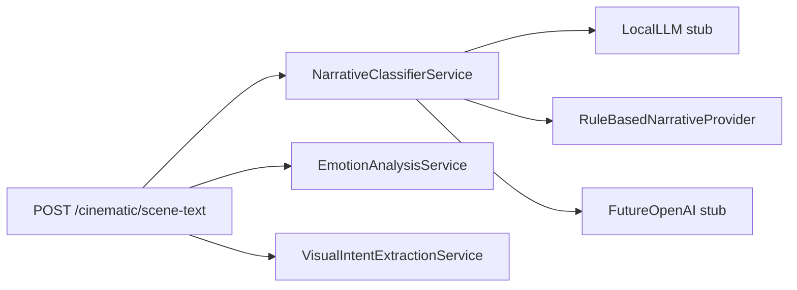
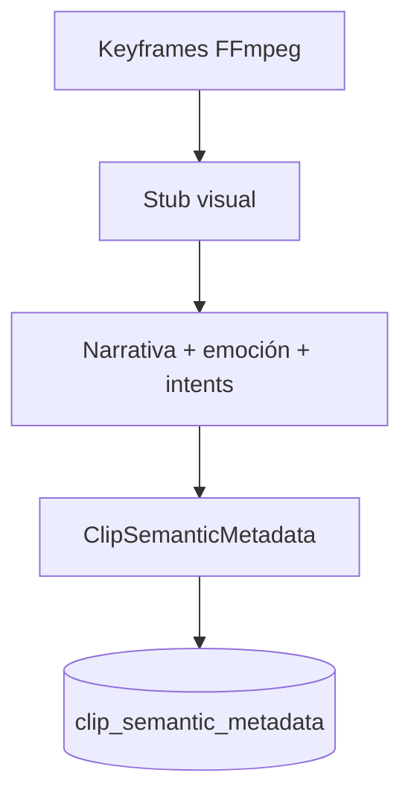

# Arquitectura — Inteligencia cinematográfica (AI-COS)

Este subsistema introduce **Clean Architecture** dentro del monorepo `aicos/`, alineado con las reglas existentes (SQLite en `database/`, FFmpeg solo en `ffmpeg_service.py`, API vía `aicos/models/schemas.py`).

## Capas

| Capa | Ruta | Responsabilidad |
|------|------|-----------------|
| Dominio | `aicos/domain/cinematic/` | Enums y entidades (`ClipSemanticMetadata`, `EmotionAnalysis`, `VisualIntent`, resultados de narrativa). Sin I/O. |
| Aplicación | `aicos/application/cinematic/` | Casos de uso, puertos (`ports.py`), reglas locales, ranking multi-factor, pipeline orquestado. |
| Infraestructura | `aicos/services/cinematic_*`, `aicos/database/db.py` | SQLite (repositorio), FFmpeg (keyframes), stubs de visión. |
| Presentación | `aicos/api/routers/cinematic_intel.py` | FastAPI solo cablea servicios y DTOs Pydantic. |

## Flujo de texto (local)

## Flujo de pipeline de clip (resumen)

## Próximos pasos sugeridos

- Conectar **OpenCLIP** / visión local detrás de `VisualAnalysisPort`.
- **Hybrid search** y filtros por metadata en `vector_store.py` (Chroma solo ahí).
- **Ollama** detrás de `LocalLLMNarrativeProvider` cuando `enabled=true`.
- Cobertura de tests hacia el objetivo del 80 % e integración con ingesta de biblioteca.
